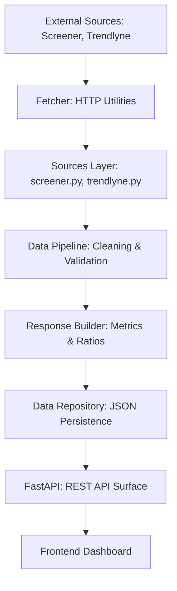

# Finox Scraper (Fundametrics Backend) — Detailed Guide

This document provides a comprehensive technical overview of the **Finox Scraper**, an internal analytics engine designed to ingest, process, and serve Indian stock market fundamentals.

## 🏗 System Architecture

The system follows a pipeline-based architecture:



## 📁 Directory Structure & Key Components

### 1. `scraper/` (The Core Engine)
- **`sources/`**: Contains the logic for specific data providers.
    - `screener.py`: Fetches balance sheets, P&L, and quarterly results from Screener.in.
    - `trendlyne.py`: Provides company profiles, industry classification, and sector data.
- **`core/`**: Orchestrates the data flow.
    - `fetcher.py`: Manages HTTP requests with rate limiting, retries, and proxy support.
    - `data_pipeline.py`: Validates raw data, handles unit conversions (e.g., Crores to Units), and sanitizes payloads.
    - `api_response_builder.py`: Maps raw financial line items to the proprietary **Fundametrics** naming convention.
    - `metrics_engine.py` / `ratios_engine.py`: Computes derived metrics (ROE, ROCE, Growth Rates).
- **`main.py`**: The primary entry point for running a scrape job manually or via scheduler.

### 2. `api/` (The Service Layer)
- **`main.py`**: A FastAPI application that serves the processed data.
- **`endpoints.py`**: Defines RESTful routes for accessing stocks, historical runs, and trends.
- **`schemas.py`**: Pydantic models for request/response validation.

### 3. `db/` (The Database Layer)
- **`manager.py`**: Handles SQLAlchemy connections.
- **`models.py`**: DB tables (Companies, Facts, Financials) for long-term relational storage.
- **`repository.py`**: CRUD operations for the relational database.

### 4. `data/` (Persistence)
- **`processed/`**: Stores every successful scrape run as a unique JSON document, allowing for point-in-time historical analysis.

## 📊 Data Processing Flow

1.  **Ingestion**: `ScreenerScraper` fetches HTML tables from source URLs.
2.  **Normalization**: `DataPipeline` converts the unstructured HTML arrays into typed dictionaries.
3.  **Transformation**: `FundametricsResponseBuilder` renames generic line items to specific platform IDs (e.g., `Net Profit` becomes `fundametrics_net_income`).
4.  **Computation**: The engine computes internal metrics like **CAGR Revenue** and **Linear Regression on Promoter Holding**.
5.  **Persistence**: The final payload is saved to disk and optionally indexed in the SQL database.

## 🚦 How to Run

### Prerequisite: Environment Setup
Ensure a `.env` file exists in the root directory:
```env
DATABASE_URL=sqlite+aiosqlite:///./finox_stock_data.db
APP_ENV=development
DEBUG=true
```

### Running the Scraper
To scrape specific stocks (e.g., RELIANCE and TCS):
```bash
python -m scraper.main --symbol RELIANCE
```

### Starting the API
```bash
python -m uvicorn api.main:app --reload --port 8000
```

## 📋 Proprietary Metrics Definitions

All derived analytics are computed internally using **Fundametrics Formulas**:
- **Fundametrics ID**: `fundametrics_operating_margin`
    - *Formula*: `(Operating Profit / Revenue) * 100`
- **Fundametrics ID**: `fundametrics_eps`
    - *Formula*: `Net Income / Shares Outstanding`
- **Fundametrics ID**: `fundametrics_revenue_growth_annualized`
    - *Formula*: Compounded Annual Growth Rate (CAGR) over available years.

## 🛡 Observability & Reliability
- **Structured Logging**: All runs generate JSON logs for easy parsing by monitoring tools.
- **Validation Reports**: Every run includes a validation block indicating if data was missing or units were misaligned.
- **Deterministic Runs**: Every scrape is assigned a UUID `run_id`, ensuring the backend can always serve the exact data used for a specific analysis.

---
**Confidentiality Note**: This scraper uses proprietary Fundametrics mapping and logic. Do not expose internal metric IDs to third-party APIs.
